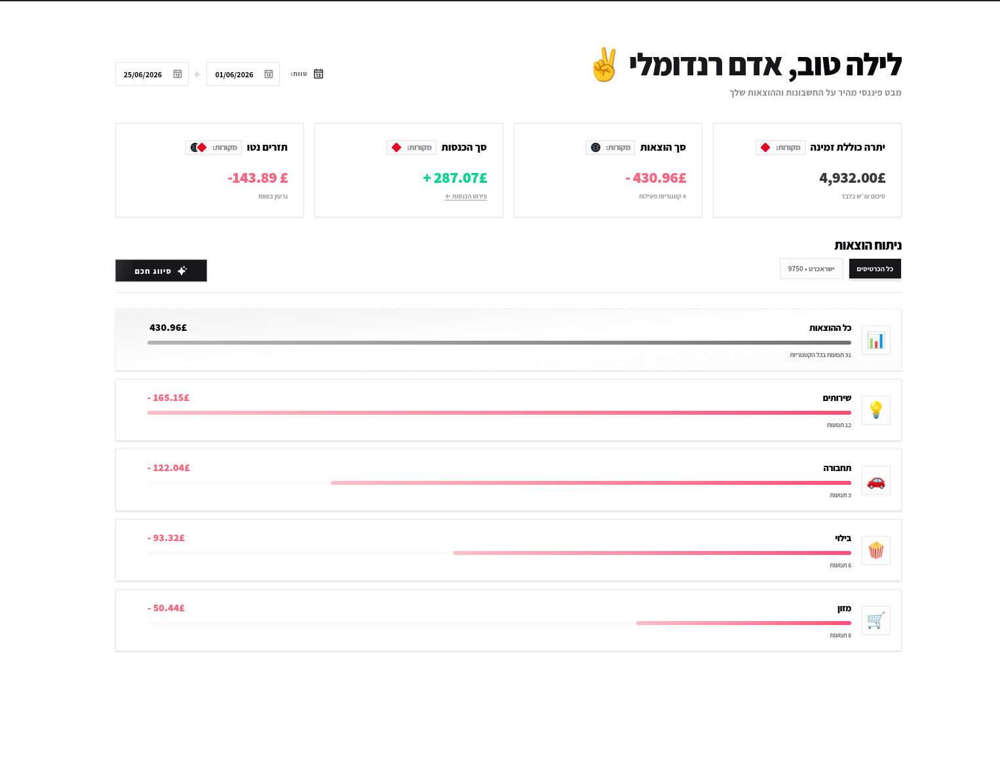
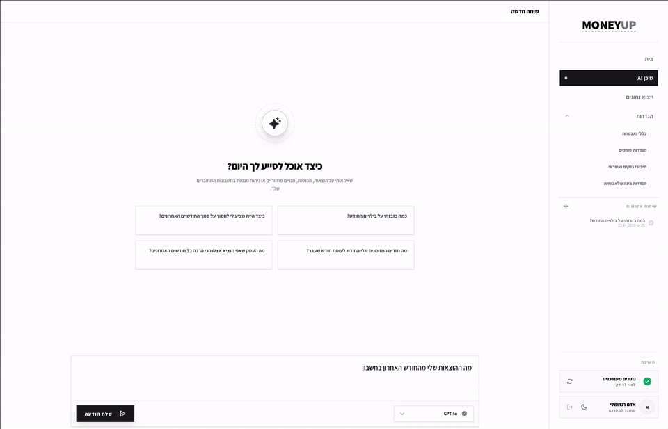
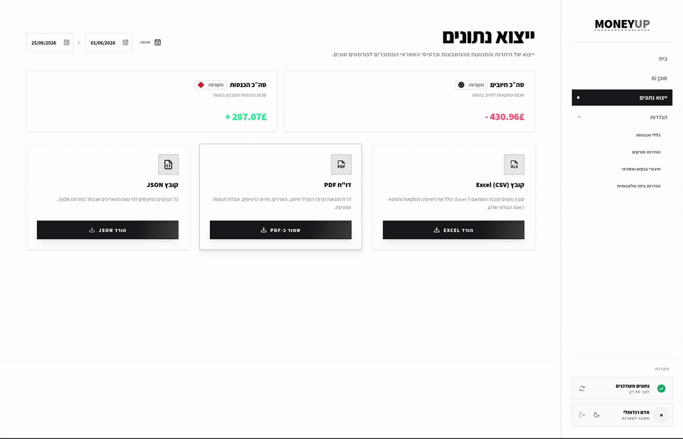
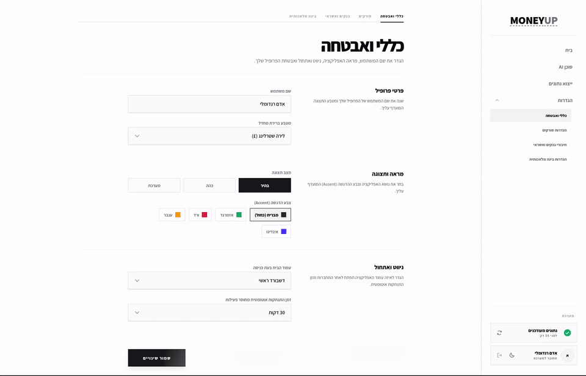

# MoneyUp 💰
> A local, AI-powered personal finance dashboard that securely scrapes your bank and credit card accounts, categorizes your spending, and gives you actionable insights — all running on your own machine.
<p align="center">
  
</p>

## Features

- **Bank & Credit Accounts Sync** — Securely fetch and synchronize transactions via [israeli-bank-scrapers](https://github.com/eshaham/israeli-bank-scrapers).
- **AI Categorization** — Automatic and smart classification of spending into logical categories (Food, Fuel, Utilities, etc.).
- **AI Agent Screen** — Actionable insights and conversational chat supporting ChatGPT, Claude, Gemini, and Ollama models.
- **Export Screen** — Easily export transaction histories and financial data to Excel, PDF, and JSON formats.
- **Privacy First** — Local SQLite database with **AES-256-GCM** encryption. Your financial credentials and data never leave your machine.
- **Variety of Configuration Screens** — Intuitive interfaces to customize scrapers, categories, model keys, security configurations, and user preferences.

---

## Previews

Here is a glimpse of the MoneyUp interface in action:

### 🤖 AI Agent Screen
*Chat with your customized local or cloud AI models (supporting ChatGPT, Claude, Gemini, or Ollama) to analyze your spending habits.*



### 📤 Export Screen
*Export your transaction histories, categories, and summaries directly to Excel, PDF, or JSON format.*



### ⚙️ Bank Scrapers & Security Settings
*Configure your credentials and scrape Israeli bank/credit card accounts securely with local AES-256-GCM encryption.*



---

## Supported Institutions

<sub>*Status of currently implemented scrapers and planned integrations.*</sub>

| <small>Banks</small> | <small>Status</small> | <small>Credit Cards</small> | <small>Status</small> |
|:---|:---|:---|:---|
| <small>בנק הפועלים (Hapoalim)</small> | <small>Enabled</small> | <small>MAX (מקס)</small> | <small>Enabled</small> |
| <small>בנק לאומי (Leumi)</small> | <small>Enabled</small> | <small>ישראכרט (Isracard)</small> | <small>Enabled</small> |
| <small>בנק יהב (Yahav)</small> | <small>Enabled</small> | <small>כאל (Cal)</small> | <small>Enabled</small> |

---

## Architecture

MoneyUp is structured as a **pnpm monorepo** containing a NestJS monolith backend, a React (Vite) web client, and a Tauri desktop client:

```
apps/
  server/         ← NestJS Monolith backend server (compiled via SWC, port 3000)
  web/            ← React + Vite web client (RTL, port 5173)
  desktop/        ← Tauri desktop client (production-ready, native wrappers for Windows & Linux)

packages/
  common/         ← Shared utilities, exception filters, interceptors, and model definitions
  types/          ← Shared TypeScript interfaces, schemas, and Zod validators
```

---

## Prerequisites

To run MoneyUp, you only need:
- **Node.js** > 20
- **A Chromium-based browser** (Chrome, Edge, Chromium, etc.) — if no browser is detected on your system, the application will automatically install one for you.
- **A supported bank or credit card account** from supported institutions (see [Supported Institutions](#supported-institutions))
- **An AI Provider Key** (ChatGPT, Claude, Gemini, or Ollama) for the AI-powered features

---

## Quick Start

The easiest way to run MoneyUp is to use one of the pre-built releases or run via Docker.

### 1. Windows / Linux Releases (Recommended! 🚀)
Download the latest pre-compiled desktop bundle for your system from the [Releases](https://github.com/roee1454/MoneyUp/releases) page.
- **Windows**: Install the `.msi` or run the portable executable.
- **Linux**: Run the `.AppImage` or install the `.deb` package.

### 2. Docker (Also Recommended! 🐳)
Run the entire stack in production mode with a single command:
```bash
git clone https://github.com/roee1454/MoneyUp
cd MoneyUp
cp .env.example .env # Set up your environment variables
docker compose -f infra/compose.yml up
```

### 3. Production Mode (Local Build 🛠️)
To build and run the application locally in production mode:
```bash
# Clone the repository
git clone https://github.com/roee1454/MoneyUp
cd MoneyUp

# Install workspace dependencies
pnpm install

# Build all applications and packages
pnpm build

# Start the server and client preview
# In one terminal, start the server:
pnpm server:start

# In another terminal, preview the web application:
pnpm client:start
```

### 4. Development Mode (Local Dev 💻)
To start the workspace in development mode (with hot-reloading):
```bash
# Install dependencies
pnpm install

# Run backend services + web client concurrently
pnpm dev
```

---

## Terms of Service & Disclaimer

> [!IMPORTANT]
> **By using MoneyUp, you acknowledge and agree to the following:**
> 
> - **MIT License** — Open source software provided "as is" without warranty or liability.
> - **Local Only** — All credentials and financial data are stored encrypted **only** on your machine.
> - **Third-Party Scraping** — You are responsible for ensuring automated access complies with your bank's TOS.
> - **Patched Library** — Ships with a locally patched `israeli-bank-scrapers` build for enhanced features. No telemetry. You are free to inspect the patch (diff against the original release).
> - **AI Providers** — Using AI features sends summarized (non-credential) transaction data to your chosen provider.

---

## Security Disclaimer

> [!WARNING]
> **Providing your financial account credentials to any software is not risk-free.**
> 
> While I do my absolute best to protect your credentials through local encryption, I take no responsibility for any possible damages. If you choose to use this tool, I strongly suggest you ask your financial institution for credentials for a user that has **read-only access** to the relevant account. Using restricted credentials significantly reduces your potential risk.

---

## Contributing

Contributions are welcome. Here's how to get started:

1. **Fork** the repository and create a feature branch: `git checkout -b feature/my-feature`
2. **Install** dependencies with `pnpm install`
3. **Run** the dev environment with `pnpm dev`
4. Make your changes and ensure the code lints: `pnpm lint`
5. **Submit a Pull Request** describing your changes

### Code Style
- TypeScript strict mode throughout
- NestJS conventions for backend services
- React + Vite for the web client
- Hebrew RTL UI — all user-facing strings should be in Hebrew

### Reporting Issues
Please open a GitHub Issue with a clear description of the bug or feature request. For security vulnerabilities, please **do not** open a public issue — contact the maintainer directly.

---

<p align="center">Built with care for the Israeli developer community</p>
