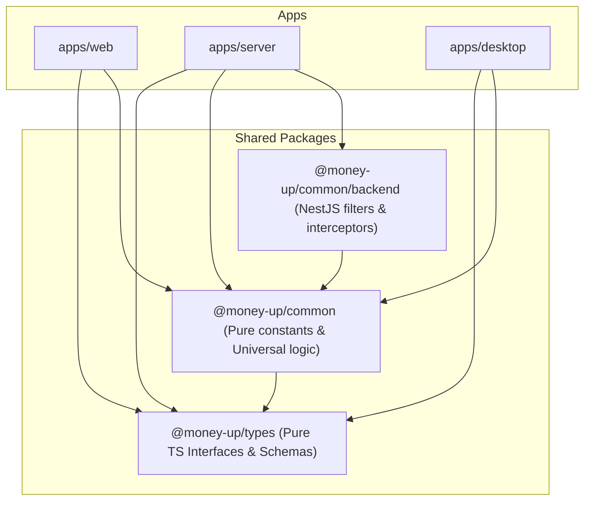

# Shared Packages (@packages) Architecture & Guidelines

This document outlines the architectural boundaries, dependency rules, and workspace resolutions for shared packages inside the MoneyUp codebase.

---

## 1. Package Hierarchy & Responsibilities

The codebase maintains a monorepo workspace containing client applications, server applications, and shared packages. Shared packages must follow a strict three-tier layout:



### 1. `@money-up/types` (Pure Types & Schemas)
- **Responsibility**: Contains shared interfaces, types, and validation schemas (e.g., Zod schemas) for API communication, scrapers, and authentication.
- **Rules**:
  - Must remain completely **stateless** (type-only).
  - Must have zero runtime dependencies (except standard utility libraries like `zod`).
  - Must be 100% platform-agnostic (run identically in browser, Node.js, or Rust Tauri bridges).

### 2. `@money-up/common` (Universal Constants & Business Logic)
- **Responsibility**: Contains cross-platform business logic, lookup tables, and constants (e.g., categorizer rules, AI models/tags, Hebrew categories).
- **Rules**:
  - Must remain **browser-safe**.
  - Must **never** import backend-only dependencies (e.g., `@nestjs/common`, `typeorm`, or Node's `fs`/`path` modules).
  - Keeps its package dependencies minimal and framework-free.

### 3. `@money-up/common/backend` (Backend-Only Shared Utilities)
- **Responsibility**: Houses reusable backend-only utilities (e.g., NestJS controllers, services, database interceptors, custom NestJS filters).
- **Rules**:
  - Must be isolated inside the `./backend` export mapping.
  - Can import NestJS libraries (`@nestjs/common`, etc.) and server-only modules.
  - **Must never** be imported by frontend clients (`apps/web`, `apps/desktop`).

---

## 2. Shared Code Rules

All contributions to the `packages/` directory must strictly adhere to the following rules:

### Rule 1: No Circular Dependencies
- Shared packages are libraries. They **must never** import code from applications (`apps/*`).
- Circular dependencies between shared packages (e.g., `@money-up/common` importing `@money-up/types`, while `@money-up/types` imports `@money-up/common`) are strictly forbidden.

### Rule 2: Workspace Resolution Over Path Aliasing
- All applications must declare shared package requirements inside `package.json` using the pnpm workspace protocol:
  ```json
  "dependencies": {
    "@money-up/common": "workspace:*",
    "@money-up/types": "workspace:*"
  }
  ```
- Path aliasing that bypasses workspace compiler boundaries (e.g., importing raw typescript source files directly like `'@money-up/common': '../../packages/common/src/index.ts'`) is an anti-pattern. Applications must resolve to pre-built compiled packages or properly managed Turborepo outputs.

### Rule 3: Pure JS/TS Constraint
- Code defined inside universal modules (like `@money-up/common` and `@money-up/types`) must compile to both **CommonJS** (CJS) and **ES Modules** (ESM).
- Avoid framework-specific globals (`window`, `document`, `process`) in root modules. Guard platform check blocks if necessary:
  ```typescript
  export const isBrowser = typeof window !== 'undefined';
  ```

### Rule 4: Clean Export Mapping
- Always expose public APIs explicitly inside `package.json` export mappings. Do not leak internal helpers or scratch modules.
  ```json
  "exports": {
    ".": {
      "types": "./dist/index.d.ts",
      "default": "./dist/index.js"
    }
  }
  ```
